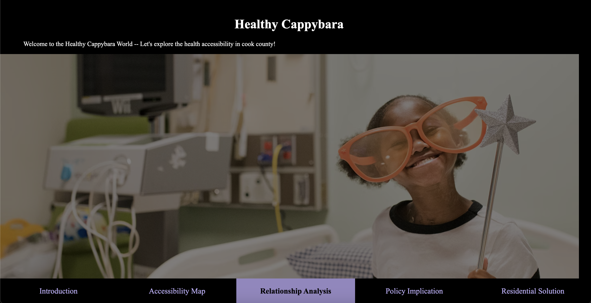

<p align="center">
  
</p>

<h1 align="center">Healthcare Accessibility in Cook County</h1>


Many individuals in the United States struggle to access necessary healthcare services. [Healthy People 2030](https://health.gov/healthypeople/objectives-and-data/browse-objectives/health-care-access-and-quality) defines Healthcare Accessibility as the capacity to obtain timely, high-quality, and affordable healthcare services. Aligning to enhance healthcare accessibility and promote healthier lives, our project aims to devise a systematic approach to improve access to healthcare within Cook County communities.

Healthcare Accessibility can be broken down into three key components:
* **Healthcare Service Capacity**: This refers to the availability of healthcare services, indicated by the number, costs, and quality ratings of hospitals, nursing homes, and home care agencies.
* **Population Demand**: This encompasses the demographic need for healthcare services, factoring in population size, growth, poverty levels, and vulnerability.
* **Geographic Impedance**: This assesses how easily residents can reach healthcare providers' locations, reflected by the gap between healthcare service capacity and population demand.

Our project employs a combination of weighting, machine learning, and geographical methods to create an index and predictive model for healthcare accessibility. We integrate data from various sources, primarily obtained through web scraping and searches, including information from the Centers for [Medicare & Medicaid Services](https://www.cms.gov/data-research), [US Census Bureau](https://data.census.gov/), and [Healthgrades](https://www.healthgrades.com/), which collectively provide details on over three million U.S. healthcare providers.

Our project offers three distinct applications beneficial to both policymakers and residents:
* [**Data Visualization**](HealthyCappybara/dash_folder/main_dash.py): It enables the visualization of healthcare accessibility across various attributes, offering a clear view of the current landscape.
* [**Analysis and Prediction**](HealthyCappybara/analysis): This feature calculates a healthcare accessibility score for each community, identifying crucial factors influencing access to healthcare.
* **Solutions Platform/Roadmap**: An interactive dashboard allows policymakers to identify communities with significant healthcare gaps while enabling residents to locate timely, high-quality healthcare providers based on their location.

### Team Member (Last Name in Alphabetic Order)
Name  | Main Code Contribution
------------- | ------------- 
Hourui Guo | 1) Analysis: random forest model; 2) Visulization: correlation matrix graph
Yijia (Gaga) He | 1) Scarping: data scraping; 2) Dashboard: UI & interactive web; 3) Visulization: geographical map
Yue (Luna) Jian | 1) Scarping: data cleaning; 2) Visulization: clustering graphs
Qi Zhao | 1) Analysis: clustering model; 2) Visulization: radar graph


## Dashboard Demo
Click the picture below to watch our dashboard demo video


[](https://youtu.be/BBvAjpx5Ang)

## Instruction to launch the application
1.  Clone the repository
```
git clone git@github.com:gagahe-cx/Healthy-Cappybara.git
```


2. Navigate to the repository
```
cd ./ Healthy-Cappybara
```

3. set up and activate the virtual environment
```
poetry install
poetry shell
```

4. Launch the App
```
python3 -m HealthyCappybara
```

5. Engage with the App (Using Alphabetical Inputs)

* (a) The Dashboard,

* (b) Scraping Data,

* (c) Clean Data,

* (d) Quit App.


6. Option 2 has three sub-options. Users can input their specific criteria for conducting web scraping.
* Condition 1: How many medical categories do you want to crawl?
* Condition 2: How many cities do you want to crawl?
* Condition 3: Do you want to crawl now?
* Upon completion, the message " Congratulations! The data has been successfully crawled and saved to {file location}!" will be displayed.


7. Code Reference
* Scraping: https://www.zenrows.com/blog/selenium-python-web-scraping#headless-chrome
* Dashboard: https://github.com/plotly/dash-sample-apps


## Package used
pandas\
folium\
plotly\
matplotlib\
pathlib\
dash\
json\
numpy\
base64\
lxml\
selenium\
sklearn\
webdriver-manager

## Data Sources

### Health Service Part
Name  | Source | Collection Way | Responsible Team Members
------------- | ------------- | ------------- | -------------
Physicians' information on healthgrades  | [healthgrades website](https://www.healthgrades.com/)| Web Scraping | Gaga, Luna
Patient survey (HCAHPS) - In Patient Hospital  | [Data.CMS website](https://data.cms.gov/provider-data/dataset/dgck-syfz) | CSV file available | Hourui
Outpatient & Ambulatory Surgery CAHPS Survey |  [Data.CMS website](https://data.cms.gov/provider-data/dataset/48nr-hqxx) | CSV file available | Hourui
Nursing Home Provider Information | [Data.CMS website](https://data.cms.gov/provider-data/dataset/4pq5-n9py) | CSV file available | Hourui
Health Expenses&Beds for Hospital - Hospital Provider Cost Report | [Data.CMS website](https://data.cms.gov/provider-compliance/cost-report/hospital-provider-cost-report) | CSV file available | Qi
Health Expenses&Beds for Nursing - Skilled Nursing Facility Cost Report | [Data.CMS website](https://data.cms.gov/provider-compliance/cost-report/skilled-nursing-facility-cost-report) | CSV file available | Qi
Health Expenses for Homecare- Home Health Agency Cost Report | [Data.CMS website](https://data.cms.gov/provider-compliance/cost-report/home-health-agency-cost-report) | CSV file available | Qi
CMS Manual System | [CMS.gov](https://www.cms.gov/regulations-and-guidance/guidance/transmittals/downloads/r29soma.pdf) | PDF file available | Hourui

### Population Demand Part
Name  | Source | Collection Way | Responsible Team Members
------------- | ------------- | ------------- | -------------
Demographic data | [US Census Bureau](https://data.census.gov/table?q=demographic&g=050XX00US17031$8600000) | CSV file available | Qi
Income Data | [US Census Bureau](https://data.census.gov/table?t=Earnings&g=050XX00US17031) | CSV file available | Qi
Health Insurance Coverage | [US Census Bureau](https://data.census.gov/table?t=Health%20Insurance&g=050XX00US17031) | CSV file available | Qi
Employment | [US Census Bureau](https://data.census.gov/table?t=Employment&g=050XX00US17031) | CSV file available | Qi
Social Characteristics |  [US Census Bureau](https://data.census.gov/table?q=Selected%20Characteristics&g=050XX00US17031$8600000) | Shapefile available | Qi
Poverty Situation | [US Census Bureau](https://data.census.gov/table?q=poverty&g=050XX00US17031$8600000) | Shapefile available | Qi

### Geographic information
Name  | Source | Collection Way | Responsible Team Members
------------- | ------------- | ------------- | -------------
 ZCTA Code | [US Census Bureau](https://www.census.gov/geographies/mapping-files/time-series/geo/cartographic-boundary.html) | Shapefile available | Qi
 Zip Code with Longitude and Latitude |  [US Zip Codes from 2013 Government Data](https://gist.github.com/erichurst/7882666) | GeoJson available | Qi
